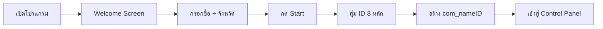
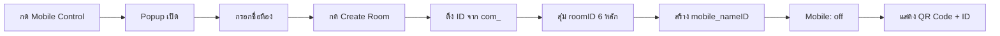
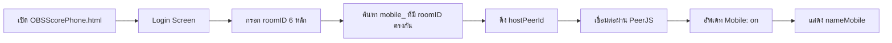

# Firebase Data Structure Guideline

> 📋 เอกสารแนวทางการจัดเก็บข้อมูลใน Firebase สำหรับระบบ OBSScore Control Panel  
> เพื่อใช้อ้างอิงในการพัฒนาและแก้ไขในอนาคต

---

## โครงสร้างข้อมูลหลัก (Firebase Realtime Database)

```
obs_rooms_score/
├── com_{nameID}/          # PC User Presence
│   ├── name: string       # ชื่อผู้ใช้
│   ├── platform: "PC"     # แพลตฟอร์ม
│   ├── province: string   # จังหวัด
│   ├── ID: string         # 8-digit unique ID
│   └── last_seen: timestamp
│
└── mobile_{nameID}/       # Mobile Control Room
    ├── nameMobile: string # ชื่อห้อง
    ├── platform: "Mobile" # แพลตฟอร์ม
    ├── ID: string         # 8-digit ID (same as com_)
    ├── roomID: string     # 6-digit connection ID
    ├── Mobile: "off"|"on" # สถานะการเชื่อมต่อ
    ├── hostPeerId: string # PeerJS connection ID
    └── created: timestamp
```

---

## 1. PC User Presence (`com_{nameID}`)

### จุดประสงค์
- แสดงผู้ใช้ที่กำลังเปิดโปรแกรมอยู่ (PC)
- ใช้สำหรับแสดงใน Online Users list

### การสร้าง
**เมื่อ**: กดปุ่ม "Start" ในหน้า Welcome Screen  
**ไฟล์**: `fcp_v2_assets/main.js` → Welcome Start button  
**ฟังก์ชัน**: `window.initOnlinePresenceSystem()` ใน `remote.js`

### ข้อมูลที่เก็บ
| Field | Type | ค่า | คำอธิบาย |
|-------|------|-----|----------|
| `name` | string | ชื่อที่กรอกในหน้า Welcome | สูงสุด 30 ตัวอักษร |
| `platform` | string | `"PC"` | ระบุว่าเป็น PC |
| `province` | string | จังหวัดที่เลือก | จาก dropdown หรือ custom |
| `ID` | string | 8-digit random | สุ่มเมื่อกด Start |
| `last_seen` | timestamp | Firebase ServerValue | อัพเดทอัตโนมัติ |

### Key Naming
```javascript
const sanitizedName = sanitizeKey(identity.name); // เอาตัวอักษรพิเศษออก
const roomKey = `com_${sanitizedName}`;
// ตัวอย่าง: "com_JamornzMedia"
```

### Lifecycle
- **Create**: เมื่อกด Start button
- **Delete**: เมื่อปิดโปรแกรม (onDisconnect)

---

## 2. Mobile Control Room (`mobile_{nameID}`)

### จุดประสงค์
- เก็บข้อมูลห้องสำหรับควบคุมผ่านมือถือ
- ใช้ ID เดียวกับ `com_` เพื่อเชื่อมโยงว่าเป็นคนเดียวกัน
- เก็บ roomID สำหรับมือถือเชื่อมต่อ

### การสร้าง
**เมื่อ**: กดปุ่ม "Create Room" ใน Mobile Control popup  
**ไฟล์**: `fcp_v2_assets/main.js` → `setupMobileRoomLogic()` → createRoomBtn  
**ตำแหน่ง**: บรรทัด ~1874-1924

### ข้อมูลที่เก็บ
| Field | Type | ค่า | คำอธิบาย |
|-------|------|-----|----------|
| `nameMobile` | string | ชื่อห้องที่กรอก | ชื่อที่แสดงในมือถือ |
| `platform` | string | `"Mobile"` | ระบุว่าเป็น Mobile room |
| `ID` | string | 8-digit (same as com_) | **ใช้ ID เดียวกับ com_ เพื่อจับคู่** |
| `roomID` | string | 6-digit random | ID สำหรับมือถือพิมพ์เชื่อมต่อ |
| `Mobile` | string | `"off"` → `"on"` | สถานะการเชื่อมต่อ |
| `hostPeerId` | string | `fcp-v2-host-{roomID}` | PeerJS connection ID |
| `created` | timestamp | Firebase ServerValue | เวลาสร้างห้อง |

### Key Naming
```javascript
const sanitizedName = sanitizeKey(userIdentity.name);
const roomKey = `mobile_${sanitizedName}`;
// ตัวอย่าง: "mobile_JamornzMedia"
```

### Lifecycle
- **Create**: เมื่อกด Create Room
- **Update Mobile field**: 
  - `"off"` → `"on"` เมื่อมือถือเชื่อมต่อสำเร็จ
  - `"on"` → `"off"` เมื่อมือถือตัดการเชื่อมต่อ
- **Delete**: เมื่อกด Close Room หรือปิดโปรแกรม

---

## 3. ความสัมพันธ์ระหว่าง com_ และ mobile_

### การจับคู่ (Matching Logic)

```
com_JamornzMedia          mobile_JamornzMedia
├── ID: "12345678"   ←──┐  ├── ID: "12345678"
├── name: "Jamornz"     └──┼── nameMobile: "My Room"
└── platform: "PC"         ├── roomID: "654321"
                           └── Mobile: "on"
```

**กฎการจับคู่**:
1. เปรียบเทียบ `ID` field (8-digit)
2. ถ้า `com_.ID === mobile_.ID` → เป็นคนเดียวกัน
3. แสดงใน Online Users:
   - ถ้า `Mobile === "off"` → แสดงแค่ PC icon
   - ถ้า `Mobile === "on"` → แสดง PC icon + Phone icon

---

## 4. Flow การทำงาน

### 4.1 PC User เข้าระบบ



**Code Location**: `main.js` บรรทัด ~1999-2018 (Start button)

---

### 4.2 สร้างห้อง Mobile Control



**Code Location**: `main.js` บรรทัด ~1875-1924 (createRoomBtn)

---

### 4.3 มือถือเชื่อมต่อ



**Code Location**: `OBSScorePhone.html` → `connectToRoom()` function

---

## 5. Online Users Display Logic

### การแสดงผล

```javascript
// Pseudo code
for (let room in allRooms) {
    if (room.startsWith('com_')) {
        // แสดง PC user
        displayUser({
            name: room.name,
            province: room.province,
            icon: 'desktop' // PC icon
        });
        
        // เช็คว่ามี mobile_ ที่ ID ตรงกันไหม
        let mobileRoom = findMobileByID(room.ID);
        if (mobileRoom && mobileRoom.Mobile === 'on') {
            // แสดง phone icon ในแถวเดียวกัน
            addPhoneIcon();
        }
    }
}
```

### ตาราง Logic

| Condition | PC Icon | Phone Icon |
|-----------|---------|------------|
| มี com_ อย่างเดียว | ✅ | ❌ |
| มี com_ + mobile_ (Mobile: "off") | ✅ | ❌ |
| มี com_ + mobile_ (Mobile: "on") | ✅ | ✅ |

**Code Location**: `remote.js` → Online Users monitoring section

---

## 6. ตัวอย่างข้อมูลจริงใน Firebase

```json
{
  "obs_rooms_score": {
    "com_JamornzMedia": {
      "name": "JamornzMedia",
      "platform": "PC",
      "province": "กรุงเทพมหานคร",
      "ID": "87654321",
      "last_seen": 1739631234567
    },
    "mobile_JamornzMedia": {
      "nameMobile": "My Scoreboard",
      "platform": "Mobile",
      "ID": "87654321",
      "roomID": "123456",
      "Mobile": "on",
      "hostPeerId": "fcp-v2-host-123456",
      "created": 1739631234567
    }
  }
}
```

ในตัวอย่างนี้:
- ✅ `com_` และ `mobile_` มี ID เดียวกัน (`87654321`)
- ✅ Online Users จะแสดง **PC icon + Phone icon**
- ✅ มือถือเชื่อมต่อด้วย roomID `123456`

---

## 7. จุดสำคัญที่ต้องระวัง

### ⚠️ ID ต้องตรงกัน
- `com_.ID` และ `mobile_.ID` **ต้องเป็นค่าเดียวกัน**
- สร้างเมื่อกด Start (8-digit random)
- เก็บใน `window.myUserID` เพื่อใช้ตอนสร้าง mobile room

### ⚠️ Key Naming
- ใช้ `sanitizeKey()` เพื่อลบตัวอักษรพิเศษ
- ห้ามใช้: `.`, `#`, `$`, `[`, `]`, `/`
- `com_` และ `mobile_` ใช้ name เดียวกัน

### ⚠️ Mobile Status
- เริ่มต้น: `"off"`
- เชื่อมต่อ: `"on"`
- ตัดการเชื่อมต่อ: `"off"`

---

**อัพเดทล่าสุด**: 15 ก.พ. 2026  
**เวอร์ชัน**: 2.9.1
